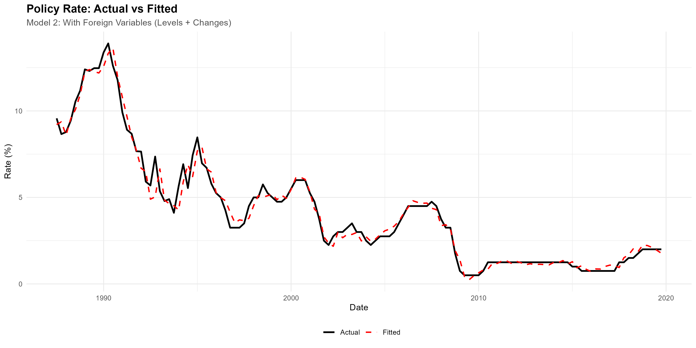

<div align="center">

<br/>


<br/><br/>

## Episode 01 — Topic To be Confirmed


</div>

---

## Presenter


**Jamel Saadoui, PhD** · University of Paris 8<br>
*Current Role: Full time Professor of Economics*<br>
Fields: Applied Macroeconomics · Political Economics · International Economics

📧 [email@domain.com](mailto:email@domain.com) &nbsp;·&nbsp;
🔗 [LinkedIn](https://www.linkedin.com/in/pr-jamel-saadaoui-7979461a5/) &nbsp;·&nbsp;
📄 [Google Scholar](https://scholar.google.com/citations?user=DkhUQ-gAAAAJ&hl=en&oi=ao) &nbsp;·&nbsp;
📑 [SSRN](https://ssrn.com)

<br clear="left">

---

## Overview

This tutorial introduces the **Vector Autoregression (VAR)** framework and provides a hands-on implementation for forecasting applications. We estimate a bivariate VAR(1) model, assess model fit, and generate out-of-sample forecasts with impulse response analysis.

**What you will learn:**
- How to specify and estimate a VAR model
- How to interpret coefficient matrices and lag structure
- How to produce and visualize forecasts and impulse response functions

---

## Video Tutorial

[](https://www.youtube.com/watch?v=SAfLK8Ji2ZM)

> *Click the thumbnail to watch on YouTube.*

---

## Mathematical Representation

A bivariate VAR(1) model is defined as:

$$
Y_t = c + A_1 Y_{t-1} + \varepsilon_t
$$

where:

| Symbol | Definition |
|--------|-----------|
| $Y_t \in \mathbb{R}^2$ | Vector of endogenous variables at time $t$ |
| $c \in \mathbb{R}^2$ | Intercept vector |
| $A_1 \in \mathbb{R}^{2 \times 2}$ | Coefficient matrix at lag 1 |
| $\varepsilon_t \sim \mathcal{N}(0, \Sigma)$ | Vector of white noise innovations |

For a general VAR($p$) specification:

$$
Y_t = c + \sum_{k=1}^{p} A_k Y_{t-k} + \varepsilon_t
$$

Stability requires that all eigenvalues of the companion matrix lie **inside the unit circle**.

---

## Results



The figure compares in-sample fitted values against observed data. The model captures the main cyclical dynamics, with residuals consistent with the white noise assumption.

---

## Repository Structure

```
Episode-01-VAR-Forecasting/
├── code/           # Replication scripts
├── data/           # Dataset
├── figures/        # Output figures and plots
├── paper/          # References and related readings
├── slides/         # Presentation slides
└── README.md
```

---

## Quick Start

```bash
# 1. Clone the repository
git clone https://github.com/your-org/Episode-01-VAR-Forecasting.git
cd Episode-01-VAR-Forecasting

# 2. Install required packages (R)
Rscript code/install_packages.R

# 3. Run the main script
Rscript code/main.R

# 4. Outputs will appear in figures/
```

---

## Requirements

**R (≥ 4.1.0)**

```r
install.packages(c("vars", "ggplot2", "tseries", "forecast", "dplyr"))
```

| Package | Version | Purpose |
|---------|---------|---------|
| `vars` | ≥ 1.5 | VAR estimation and IRF |
| `ggplot2` | ≥ 3.4 | Visualization |
| `tseries` | ≥ 0.10 | Unit root tests |
| `forecast` | ≥ 8.21 | Forecasting utilities |
| `dplyr` | ≥ 1.1 | Data manipulation |

---

## Replication

All results in this tutorial are fully replicable. Run the scripts in the following order:

```r
source("code/install_packages.R")   # Install dependencies
source("code/main.R")               # Run full analysis
```

Expected runtime: < 1 minute on a standard laptop.

---

## Citation

If you use this material in your research or teaching, please cite the intellectual author of this episode:

```bibtex
@misc{saadoui2025var,
  author    = {Saadoui, Jamel},
  title     = {VAR Forecasting — {EconLab} Tutorial Series, Episode 01},
  year      = {2025},
  publisher = {Forecasting Economics — EconLab with Experts},
  url       = {https://github.com/your-org/Episode-01-VAR-Forecasting}
}
```

---

## License & Intellectual Property

This material is licensed under [CC BY-NC-ND 4.0](https://creativecommons.org/licenses/by-nc-nd/4.0/).

© **Forecasting Economics — EconLab with Experts**. All rights reserved.

The replication code, slides, and all intellectual content are the property of **Forecasting Economics — EconLab with Experts** and of the episode presenter as the intellectual author of the material.

**You may not:**
- Use this material for commercial purposes or economic gain
- Reproduce, distribute, or adapt this content without proper citation
- Use the replication code without citing the intellectual author

**If you use this material, you must cite:**
- The presenter/author of the episode (see Presenter section above)
- This repository and Forecasting Economics as the source

For permissions, licensing inquiries, or any questions on proper use, contact:  
📧 [juan.damico@forecastingeconomics.com](mailto:juan.damico@forecastingeconomics.com)

---

<div align="center">
<sub>EconLab with Experts · Forecasting Economics · 2026</sub>
</div>
